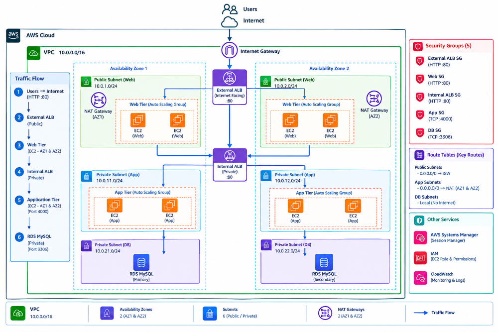
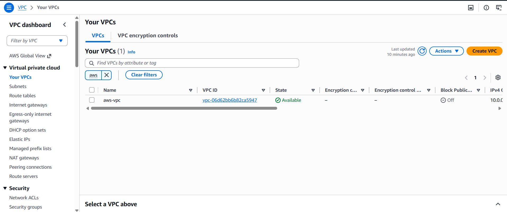
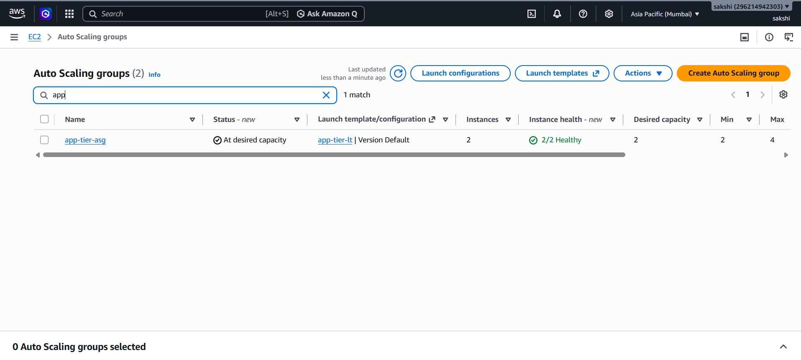
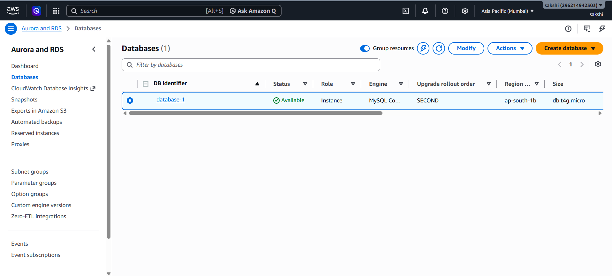
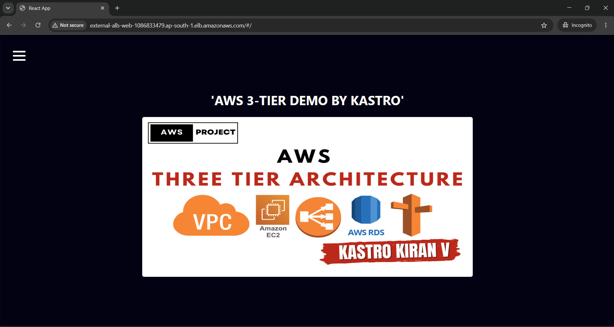

# AWS 3-Tier High Availability Architecture

Production-oriented 3-tier web application deployed on AWS across
two Availability Zones with load balancing, Auto Scaling, private
application/database tiers, and secure instance management.

## Architecture

  

## Project Overview

This project demonstrates the deployment of a three-tier web application
on AWS with separate Web, Application, and Database layers.

The Web and Application tiers are distributed across two Availability
Zones using Auto Scaling Groups and Application Load Balancers, while
the Application and Database tiers remain private.

**Request flow:**

`Internet → External ALB → Web → Internal ALB → App → RDS MySQL`

## AWS Services

| Category | Services |
|---|---|
| Compute | EC2, Auto Scaling |
| Networking | VPC, Subnets, Route Tables, Internet Gateway, NAT Gateway |
| Load Balancing | Application Load Balancer |
| Database | Amazon RDS MySQL |
| Security | Security Groups, IAM |
| Management | AWS Systems Manager |
| Application | Nginx, Node.js, PM2 |

## Key Implementation

- Multi-AZ VPC with 6 subnets
- Separate public Web and private App/DB tiers
- External and Internal Application Load Balancers
- Auto Scaling for Web and Application tiers
- NAT Gateway in each Availability Zone
- Tier-based Security Groups
- RDS MySQL in private subnets
- SSM Session Manager for private EC2 access

## Application

**Web:** Nginx  
**Application:** Node.js + PM2  
**Database:** RDS MySQL

Application reference:  
[KastroVKiran/3TierArchitectureApp](https://github.com/KastroVKiran/3TierArchitectureApp)

The application was adapted for deployment within this AWS architecture.

## Troubleshooting Highlights

**RDS MySQL 8.4**  
Resolved application/database compatibility by switching the Node.js
database client from `mysql` to `mysql2`.

**Private Application Tier**  
Configured SSM-based access instead of exposing SSH access to private
instances.

**Nginx Routing**  
Resolved the HTTP/HTTPS redirect issue during ALB-based deployment.

## Screenshots

### Networking

  

### Compute

  

### Database

  

### Application Validation

  

## Result

The application was successfully deployed and validated through the
complete path:

`Internet → External ALB → Web → Internal ALB → App → RDS MySQL`

Web and Application workloads run across two Availability Zones,
while the Application and Database tiers remain private.